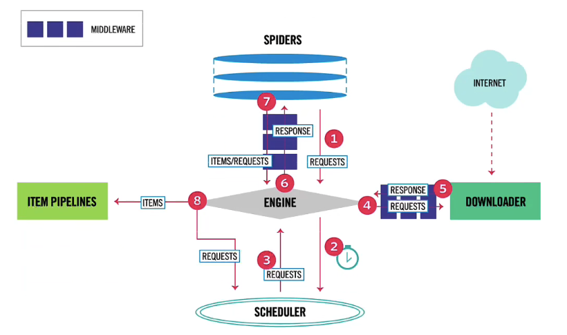

# 基于Scrapy的爬虫搭建

---
>you can prepare the env by :    
``pip install -r requirements.txt``  
> you can run the spider by :  
``scrapy crawl basic``  
> you can run the spider and put the result into the csv by :  
``scrapy crawl basic -o results.csv`` 
> 
> **Attention:   
> to start the webdriver, you need to download the "chromedriver" corresponding to your own Chrome Version, and put it in your python path.  
> you can download in following page: http://chromedriver.storage.googleapis.com/index.html**

目录结构：
```
.
├── README.md
├── item.csv
├── my_scrapy
│   ├── __init__.py
│   ├── items.py
│   ├── middlewares.py
│   ├── pipelines.py
│   ├── settings.py
│   ├── spiders
│   │   ├── __init__.py
│   │   └── basic.py
│   └── utils.py
├── requirements.txt
└── scrapy.cfg
```

## 爬虫搭建思路
### 1. 分析网页与待爬取目标元素
爬取的目标网站为：https://zhushou.360.cn/list/index/cid/102139/  
需要爬取该网站中各大App的具体信息与在线评论  
App的名称可以由App列表页直接获取，App的其余基本信息(如：应用简介等)  
需要跳转至App详情页面进行爬取
### 2. 基于scrapy框架进行爬虫搭建
#### scrapy的架构

#### 大致步骤
##### (一) 初始化
1. 使用`conda install scrapy`下载scrapy包    
2. 使用`scrapy startproject <project_name>`初始化爬虫项目 
3. 使用`scrapy genspider <spider_name> <web to crawl>`创建spider(我的spider_name为basic)
##### (二) 确定Item清单
1. 在`items.py`文件中初始化Item清单，确定要爬取的元素
##### (三) 页面解析（核心）
1. 前往spiders文件夹下的`<spider_name>.py`
2. 为了实现翻页功能，在首个页面中找到所有后续页面的url并传入request列表 
3. 修改parse函数，实现对App列表页面的解析，获得App的名称与其详情页url
4. 将App详情页url传给request，并调用解析详情页的回调函数`detail_parse()`，同时同时传入回调函数参数(App对象)
5. 书写detial_parse回调函数
##### (四) 中间件
1. 由于待爬取网站存在动态加载机制，直接使用request无法访问到动态加载部分的元素，因此借助selenium模拟浏览器访问
2. 中间件可以分为download中间件与spider中间件（前者用的多）
3. 前往`middlewares.py`文件对`MyScrapyDownloaderMiddleware`类进行修改
4. 在`__init__`中创建webdriver，webdriver的创建代码封装在`utils.py`文件中(可以重复使用)
5. 在`process_request`中利用创建的webdriver访问请求网页，并将网页内容HtmlResopnse的形式返回
6. 利用信号机制关闭webdriver：在爬虫关闭时，接收到spider_closed的信号，并调用`closeSpider`方法
##### (五) 数据处理pipeline
1. 前往`pipeline.py`文件中
2. 在`__init__`方法中创建excel表 
3. 重写`process_item`方法，从而利用正则表达式等对数据进行预处理，并将爬取到的数据写入excel文件
4. 重写`close_spider`方法，爬虫关闭时保存excel文件
##### (六) 修改settings文件（最容易忘）
1. 修改settings文件中的对应项，启用中间件和pipeline
2. 可以修改scrapy的爬虫进程数，实现更快速的爬虫

## 搭建过程中的要点
### 关于异步加载
1. **如何判断网页是否存在异步加载**   
当使用request访问网页中的元素时，使用xpath解析到的网页元素为空(``<div></div>``),但是网页中可以看到该元素；  
将Chrome中的"是否使用Javascript"选项取消勾选，再进入网页进行查看;
2. **如何解决异步加载**？    
使用selenium模拟网页登陆，将selenium部署在scrapy的中间件上

### 关于selenium中webdriver的关闭
使用官方推荐的信号传递机制，具体见middlewares.py文件

### 关于查看USER_AGENT
在chrome中打开检查，并在console中输入`navigator.userAgent`

### 关于parse函数的定义
注意需要使用yield来返回Item

## 爬取成果
1. 本次爬取一共花费时间：2小时
2. 共爬取App数量：539
3. 在线评论数：3414

## 可拓展的方向
1. 使用selenium效率低
2. 是否实现多进程？
3. 能否用ajax解析网页？